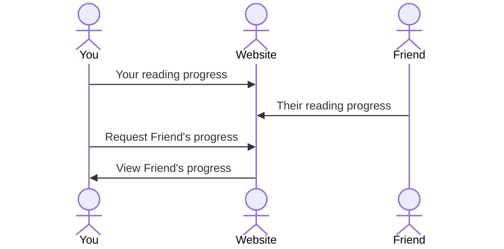

# ScripFest

[My Notes](notes.md)

I want to make an app that is for latter day saints as they study the old testament this year. It will allow for cross device note sharing, accross multiple translations of the bible. THink of it as a social media app.

<!-- > [!NOTE]
> This is a template for your startup application. You must modify this `README.md` file for each phase of your development. You only need to fill in the section for each deliverable when that deliverable is submitted in Canvas. Without completing the section for a deliverable, the TA will not know what to look for when grading your submission. Feel free to add additional information to each deliverable description, but make sure you at least have the list of rubric items and a description of what you did for each item. -->

<!-- > [!NOTE]
> If you are not familiar with Markdown then you should review the [documentation](https://docs.github.com/en/get-started/writing-on-github/getting-started-with-writing-and-formatting-on-github/basic-writing-and-formatting-syntax) before continuing. -->

## 🚀 Specification Deliverable

<!-- > [!NOTE]
> Fill in this sections as the submission artifact for this deliverable. You can refer to this [example](https://github.com/webprogramming260/startup-example/blob/main/README.md) for inspiration. -->

For this deliverable I did the following. I checked the box `[x]` and added a description for things I completed.

- [x] Proper use of Markdown
- [x] A concise and compelling elevator pitch
- [x] Description of key features
- [x] Description of how you will use each technology
- [x] One or more rough sketches of your application. Images must be embedded in this file using Markdown image references.

### Elevator pitch

Have you ever wanted to study the scriptures alongside your friends online? Have you ever wanted to keep each other in check as you go along with come follow me throughout the year? With this app you'll be able to do those things and more! This app will allows you to track your progress in the bible accross different translations. It will allow you to share this progress with your friends. It will allow you to take notes and share insight with your friends.

### Design

Sign In, Read, Note, and Friends pages.

### Key features

- READ - Be able to read from various Bible translations and updated Come, Follow Me content.
- NOTE - Be able to take notes and make them private or public.
- FRIENDS - Follow freinds and keep up with their streaks and insights. Be able to comment on their public notes.

### Technologies

I am going to use the required technologies in the following ways.

- **HTML** - Structure the top and bottom nav bars. Make the various pages.
- **CSS** - Style the icons for the nav bars. Make consistent type font.
- **React** - Commenting on posts and Scriptures. Navigating through various Bibles.
- **Service** - Login, retrieving comments and posts, retrieving streaks.
- **DB/Login** - Stores users, comments, posts, and user information, in database. Can only take notes and comments with an account.
- **WebSocket** - As users comment and publically post their insights, they are displayed on the FRIENDS page.

## 🚀 AWS deliverable

For this deliverable I did the following. I checked the box `[x]` and added a description for things I completed.

- [x] **Server deployed and accessible with custom domain name** - [My server link](http://scripfest).

## 🚀 HTML deliverable
<!-- [!NOTE]
git clone https://github.com/webprogramming260/simon-html.git
./deployFiles.sh -k <yourpemkey> -h <yourdomain> -s simon
-->
For this deliverable I did the following. I checked the box `[x]` and added a description for things I completed.

- [x] **HTML pages** - I made index, read, note, and friends html
- [x] **Proper HTML element usage** - I used body, nav, main, header, footer, img, and many other elements properly
- [x] **Links** - There are links to all the pages in the top nav, and a link to github in the bottom nav
- [x] **Text** - I wrote text for the h1 h2 h3 h4 elements and for various others
- [x] **3rd party API placeholder** - The bible text in read.html will be used from a bible online
- [x] **Images** - I added images and svgs for the various pages
- [x] **Login placeholder** - There is a login page that asks for a user to login
- [x] **DB data placeholder** - The comments will be saved to the database along with your notes
- [x] **WebSocket placeholder** - displays your frineds comments and public notes in the feed section on friends.html

## 🚀 CSS deliverable

For this deliverable I did the following. I checked the box `[x]` and added a description for things I completed.

- [x] **Visually appealing colors and layout. No overflowing elements.** - My info doesn't run off the page, and I like my color scheme
- [x] **Use of a CSS framework** - I am using the pico.css framework
- [x] **All visual elements styled using CSS** - At very least every text has custom text, I've done a lot of styling though
- [x] **Responsive to window resizing using flexbox and/or grid display** - I implamented flex for the header.
- [x] **Use of a imported font** - I used nunito font from google fonts
- [x] **Use of different types of selectors including element, class, ID, and pseudo selectors** - Pseudo selector in form of new nav a:hover. Class selector with the login button on index.html. Ids on the svgs. Elements with body, nav, main etc.

## 🚀 React part 1: Routing deliverable

For this deliverable I did the following. I checked the box `[x]` and added a description for things I completed.

- [ ] **Bundled using Vite** - I did not complete this part of the deliverable.
- [ ] **Components** - I did not complete this part of the deliverable.
- [ ] **Router** - I did not complete this part of the deliverable.

## 🚀 React part 2: Reactivity deliverable

For this deliverable I did the following. I checked the box `[x]` and added a description for things I completed.

- [ ] **All functionality implemented or mocked out** - I did not complete this part of the deliverable.
- [ ] **Hooks** - I did not complete this part of the deliverable.

## 🚀 Service deliverable

For this deliverable I did the following. I checked the box `[x]` and added a description for things I completed.

- [ ] **Node.js/Express HTTP service** - I did not complete this part of the deliverable.
- [ ] **Static middleware for frontend** - I did not complete this part of the deliverable.
- [ ] **Calls to third party endpoints** - I did not complete this part of the deliverable.
- [ ] **Backend service endpoints** - I did not complete this part of the deliverable.
- [ ] **Frontend calls service endpoints** - I did not complete this part of the deliverable.
- [ ] **Supports registration, login, logout, and restricted endpoint** - I did not complete this part of the deliverable.

## 🚀 DB deliverable

For this deliverable I did the following. I checked the box `[x]` and added a description for things I completed.

- [ ] **Stores data in MongoDB** - I did not complete this part of the deliverable.
- [ ] **Stores credentials in MongoDB** - I did not complete this part of the deliverable.

## 🚀 WebSocket deliverable

For this deliverable I did the following. I checked the box `[x]` and added a description for things I completed.

- [ ] **Backend listens for WebSocket connection** - I did not complete this part of the deliverable.
- [ ] **Frontend makes WebSocket connection** - I did not complete this part of the deliverable.
- [ ] **Data sent over WebSocket connection** - I did not complete this part of the deliverable.
- [ ] **WebSocket data displayed** - I did not complete this part of the deliverable.
- [ ] **Application is fully functional** - I did not complete this part of the deliverable.
